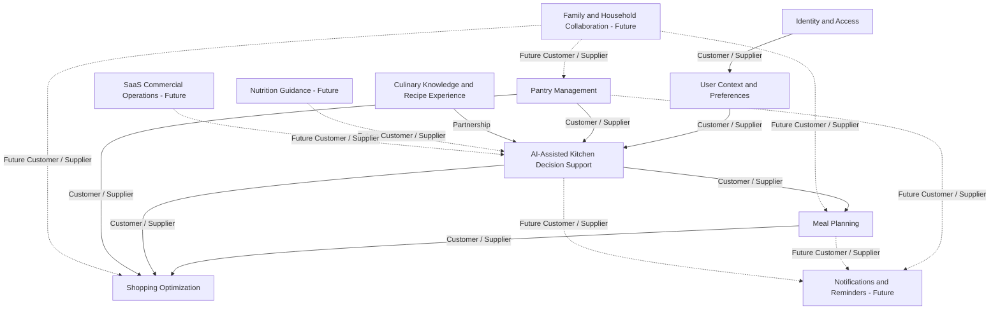
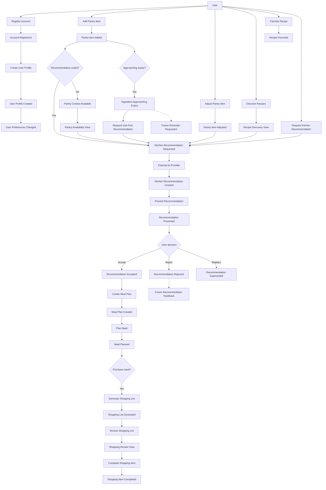

# DapurPintar AI Event Storming

## Executive Summary

Event Storming is a collaborative way to discover business behavior by starting with meaningful things that happen in the domain. For DapurPintar AI, it connects user intentions, kitchen decisions, aggregate responsibilities, policies, and business outcomes across the MVP bounded contexts.

This document provides an initial Event Storming baseline for the approved MVP. It focuses on registration, personal context, pantry management, recipe discovery, AI-assisted recommendations, meal planning, shopping, and expiry awareness. The Core Domain remains AI Kitchen Intelligence, expressed as AI-Assisted Kitchen Decision Support. AI proposes and explains decisions; users remain the final decision-makers for meals and purchases.

The flows are discovery hypotheses, not final process specifications. They are intended to guide the next collaborative Event Storming session and to expose ownership, missing rules, ambiguous language, and future domain boundaries. No database design, Go code, REST API, or infrastructure behavior is defined here.

## Domain Vision

Help people decide what to cook using available ingredients, personal preferences, and trustworthy AI guidance while reducing food waste.

This vision is the north star for Event Storming. Every command, policy, and event should help the user make a better kitchen decision or complete a related kitchen action without taking decision-making authority away from the user.

## Event Storming Principles

### Actor

An Actor is a person, household participant, business role, or trusted external party that initiates or participates in a business action.

For the MVP, the primary Actor is the **User**. Future actors include a household member, nutrition professional, grocery partner, or commercial participant. An Actor represents business intent, not a technical client.

### Command

A Command is an expressed intention to change business state or request a business decision. It is phrased as an action, such as **Register Account**, **Add Pantry Item**, **Request Kitchen Recommendation**, **Plan Meal**, or **Generate Shopping List**.

A command may be accepted, rejected, or require clarification according to business policies. A command is not itself proof that a business change occurred.

### Domain Event

A Domain Event is a meaningful business fact that has already happened. It is phrased in the past tense, such as **Account Registered**, **Pantry Item Added**, **Kitchen Recommendation Created**, **Meal Planned**, or **Shopping List Generated**.

Events describe business history and allow teams to discuss cause, consequence, and ownership. They do not define a technical messaging mechanism in this document.

### Aggregate

An Aggregate is a cluster of business concepts governed by one Aggregate Root. It protects a set of business invariants and owns the decision about whether a change is valid.

The MVP aggregates are:

- **Account:** trusted identity and access state.
- **User Profile:** personal preferences and cooking constraints.
- **Pantry:** available ingredients, quantities, and expiry context.
- **Recipe:** recipe meaning and cooking guidance.
- **Kitchen Recommendation:** contextual decision support and recommendation state.
- **Meal Plan:** daily or weekly meal intention.
- **Shopping List:** intended purchases and shopping status.

An Aggregate may use meaning from another Aggregate but must not take ownership of it.

### Policy

A Policy is a business rule that decides what should happen when a condition is met. Policies may guide or trigger a command, prioritize an option, or reject a decision that violates a known constraint.

Examples include:

- Prefer ingredients approaching expiry when suitable options are otherwise comparable.
- Do not treat generated guidance as an accepted user decision.
- Do not generate a duplicate purchase for an ingredient already sufficiently available in the pantry.
- Do not use personal context beyond the purpose accepted by the user.

### External System

An External System is a party outside the DapurPintar AI business domain that provides a capability or participates in a business flow.

The MVP external system relevant to Event Storming is an **External AI Provider**, accessed through the AI assistance boundary. Future external systems may include grocery partners, nutrition sources, payment or subscription providers, and notification delivery services. External systems must not redefine DapurPintar AI's business language.

### Read Model

A Read Model is a business view prepared for a specific question or user decision. It is not an Aggregate and does not own business state.

Examples include:

- A recipe discovery view for finding cooking options.
- A pantry availability view for understanding ingredients at hand.
- A weekly meal view for reviewing planned meals.
- A shopping review view for checking generated purchase intent.
- A recommendation presentation view for considering AI guidance.

Read Models may combine information from several contexts, but each underlying business fact remains owned by its source Aggregate.

## Business Flows

### User Registration

**Goal:** Establish a trusted account so a person can participate in personal kitchen management.

**Primary Actor:** Prospective User.

**Commands:**

- Register Account.
- Confirm Account Participation, if confirmation is required by the business policy.

**Policies:**

- An account must have a valid identity and satisfy registration requirements.
- Personal data must be collected only for a legitimate product purpose.
- A restricted or closed account cannot act as an active participant.

**Aggregates:** Account; User Profile when initial profile setup begins.

**External Systems:** None required for the business flow. An identity or confirmation party may participate in a future variation.

**Domain Events:**

- Account Registered.
- Account Access Changed, when participation is confirmed, restricted, or closed.
- User Profile Created, when initial profile setup is completed. This is a candidate event to validate during Event Storming.

**Business Outcome:** A trusted user can begin setting personal cooking context without yet having any pantry, meal, or shopping commitment.

### User Profile Management

**Goal:** Maintain the personal context needed for relevant and trustworthy kitchen assistance.

**Primary Actor:** User.

**Commands:**

- Create User Profile.
- Update Preferences.
- Update Cooking Constraints.
- Update Cooking Goals.

**Policies:**

- Preferences and constraints must be coherent and attributable to the user.
- A personal preference is private unless the user explicitly shares it in a future household context.
- Missing context reduces recommendation certainty; it must not be silently invented.

**Aggregates:** User Profile; Account for trusted participation.

**External Systems:** None for the MVP business flow.

**Domain Events:**

- User Profile Created, as a candidate event for profile initialization.
- User Preferences Changed.

**Business Outcome:** The user's relevant cooking preferences and constraints are available for personalized decision support.

### Pantry Management

**Goal:** Give the user a reliable understanding of ingredients available in the kitchen.

**Primary Actor:** User.

**Commands:**

- Add Pantry Item.
- Adjust Pantry Item.
- Remove Pantry Item.
- Review Pantry Availability.

**Policies:**

- A pantry item must identify an ingredient and meaningful quantity.
- Quantity cannot be negative.
- Expiry context must be valid when supplied.
- Pantry Management owns availability; AI recommendations cannot rewrite pantry truth.
- Removing an item does not silently create or change a shopping commitment.

**Aggregates:** Pantry; Pantry Item entity.

**External Systems:** None for the MVP business flow. Barcode, receipt, or image recognition are future inputs.

**Domain Events:**

- Pantry Item Added.
- Pantry Item Adjusted.
- Pantry Item Removed.
- Ingredient Approaching Expiry.

**Business Outcome:** The user can see what is available, what is running low, and what requires attention before it is wasted.

### Recipe Discovery

**Goal:** Help the user find usable cooking options and understand how to prepare them.

**Primary Actor:** User.

**Commands:**

- Discover Recipes.
- View Recipe Guidance.
- Favorite Recipe.

**Policies:**

- A recipe must contain enough cooking meaning to be usable.
- Discovery must not be presented as personal suitability unless the recommendation context has been applied.
- A favorite expresses user preference but does not guarantee a recipe is suitable for the current pantry or time.

**Aggregates:** Recipe; Recipe Favorite entity.

**External Systems:** None required for the MVP business flow. Future culinary partners may provide additional recipe knowledge.

**Domain Events:**

- Recipe Favorited.
- Recipe Discovered is a candidate business event only if discovery itself becomes a meaningful product outcome; ordinary browsing may remain a read-only activity.

**Business Outcome:** The user finds a recipe or cooking option that can be considered for personal recommendation or future planning.

### AI Recommendation

**Goal:** Produce practical and trustworthy cooking guidance from the user's actual context.

**Primary Actor:** User or Product Decision Flow.

**Commands:**

- Request Kitchen Recommendation.
- Present Recommendation.
- Accept Recommendation.
- Reject Recommendation.
- Supersede Recommendation.

**Policies:**

- Recommendations should consider known preferences, constraints, pantry availability, recipe possibilities, and available time.
- Suitable ingredients approaching expiry should be prioritized when appropriate.
- The recommendation must state its relevance basis or limitation.
- AI guidance remains a proposal until user acceptance or confirmation.
- The recommendation cannot claim ownership of pantry, recipe, meal-plan, shopping, or future nutrition facts.
- Personal context must be minimized to the purpose of the decision.

**Aggregates:** Kitchen Recommendation; User Profile, Pantry, Recipe, Meal Plan, and Shopping List as contributing business contexts.

**External Systems:** External AI Provider. The provider supplies assistance; DapurPintar AI owns the product meaning, safety, relevance, and acceptance state of the recommendation.

**Domain Events:**

- Kitchen Recommendation Requested.
- Kitchen Recommendation Created.
- Recommendation Presented, a candidate event to validate during Event Storming.
- Recommendation Accepted.
- Recommendation Rejected.
- Recommendation Superseded, a candidate event aligned with the recommendation lifecycle.

**Business Outcome:** The user receives an understandable cooking recommendation that can be accepted, rejected, clarified, planned, or ignored.

### Meal Planning

**Goal:** Turn accepted cooking guidance into a practical daily or weekly intention.

**Primary Actor:** User.

**Commands:**

- Create Meal Plan.
- Plan Meal.
- Change Planned Meal.
- Remove Planned Meal.
- Complete Meal Plan.

**Policies:**

- A meal plan must have a defined planning period.
- A planned meal must occupy a valid date or meal occasion.
- Accepted guidance may inform a plan, but the user or an explicit product rule owns the commitment.
- A plan should reduce decision fatigue and remain practical for the user's context.
- Changing a plan must not silently change recipe meaning or pantry truth.

**Aggregates:** Meal Plan; Planned Meal entity; Kitchen Recommendation as the source of accepted guidance.

**External Systems:** None for the MVP business flow.

**Domain Events:**

- Meal Plan Created.
- Meal Planned.
- Planned Meal Changed.
- Meal Plan Completed, a candidate event to validate as a business outcome.

**Business Outcome:** The user has a clear daily or weekly intention for what to cook.

### Shopping List Generation

**Goal:** Turn meal intent and pantry gaps into a practical, reviewable purchase intention.

**Primary Actor:** User or Product Decision Flow.

**Commands:**

- Generate Shopping List.
- Review Shopping List.
- Revise Shopping Item.
- Complete Shopping Item.
- Complete Shopping List.

**Policies:**

- Shopping need should account for available pantry quantities and planned meals.
- Generated purchase intent must be reviewable before it becomes active user intent.
- A shopping item must represent a meaningful ingredient need.
- Completion of a shopping item does not automatically change pantry truth.
- Manually added and automatically generated purchase intent must remain distinguishable when that distinction matters to the user.

**Aggregates:** Shopping List; Shopping Item entity; Pantry and Meal Plan as contributing contexts.

**External Systems:** None for the MVP business flow. Grocery partners are future external systems.

**Domain Events:**

- Shopping List Generated.
- Shopping Item Completed.
- Shopping List Completed, a candidate event to validate during Event Storming.

**Business Outcome:** The user has a reviewed list of ingredients to acquire, aligned with planned meals and existing pantry availability.

### Pantry Expiration Monitoring

**Goal:** Help the user notice ingredients that should be used before they are wasted.

**Primary Actor:** Product Decision Flow, with User as the person who acts.

**Commands:**

- Review Pantry Expiry.
- Prioritize Expiring Ingredient.
- Request Use-First Recommendation.

**Policies:**

- Pantry Management remains the authority for expiry and availability.
- An approaching expiry should influence recommendations when the resulting option is otherwise suitable.
- The product must not claim that an ingredient is expired or available without sufficient context.
- Expiry awareness must support user decisions, not silently consume or remove pantry items.

**Aggregates:** Pantry; Pantry Item entity; Kitchen Recommendation when use-first guidance is requested.

**External Systems:** None in the MVP. Notifications and Reminders may become a future external participant.

**Domain Events:**

- Ingredient Approaching Expiry.
- Kitchen Recommendation Requested.
- Kitchen Recommendation Created.
- Reminder Requested, future event when notification behavior is introduced.

**Business Outcome:** The user is guided toward using at-risk ingredients and can reduce avoidable food waste.

## Business Timeline

The following timeline presents the primary new-user journey across the MVP business contexts. It complements the feature-oriented flows by showing how value accumulates from account creation to a concrete kitchen action.

### New User Journey

`Register -> Complete Profile -> Add Pantry -> Browse Recipe -> Ask AI -> Accept Recommendation -> Meal Planning -> Generate Shopping List`

| Step | User activity | Business meaning | Main context |
|---|---|---|---|
| 1 | Register | Establish a trusted account | Identity and Access |
| 2 | Complete Profile | Provide personal preferences and cooking constraints | User Context and Preferences |
| 3 | Add Pantry | Make available ingredients visible | Pantry Management |
| 4 | Browse Recipe | Explore possible cooking options | Culinary Knowledge and Recipe Experience |
| 5 | Ask AI | Request contextual decision support | AI-Assisted Kitchen Decision Support |
| 6 | Accept Recommendation | Confirm that a proposed option is useful for the user | AI-Assisted Kitchen Decision Support |
| 7 | Meal Planning | Turn accepted guidance into a daily or weekly intention | Meal Planning |
| 8 | Generate Shopping List | Turn meal intent and pantry gaps into purchase intent | Shopping Optimization |

This timeline is a product journey, not a mandatory automation chain. Each step may be skipped, repeated, revised, or interrupted. In particular, accepting a recommendation does not automatically create a meal plan, and planning a meal does not automatically complete a purchase.

## Event Storming Hotspots

Hotspots identify uncertainty, risk, disagreement, or a likely need for deeper discovery. They are not defects and do not prescribe implementation solutions.

| Hotspot | Why it matters | Affected contexts |
|---|---|---|
| Recommendation quality | Poor relevance directly weakens the Core Domain's value proposition and acceptance rate | AI-Assisted Kitchen Decision Support, User Context and Preferences, Recipe |
| Pantry accuracy | Incorrect availability or expiry information can produce impractical recommendations and duplicate purchases | Pantry Management, AI-Assisted Kitchen Decision Support, Shopping Optimization |
| Duplicate ingredients | The same ingredient may be represented differently across pantry, recipe, meal, and shopping contexts | Pantry Management, Recipe, Meal Planning, Shopping Optimization |
| AI hallucination | Unsupported recipe, ingredient, nutrition, or availability claims can damage user trust | AI-Assisted Kitchen Decision Support, Recipe, Nutrition Guidance future |
| Missing context | Incomplete preferences, quantities, expiry dates, or time constraints may make a recommendation unsafe or irrelevant | User Context and Preferences, Pantry Management, AI-Assisted Kitchen Decision Support |
| User trust | Users need to understand why guidance was given and remain in control of acceptance | AI-Assisted Kitchen Decision Support, User Profile, Meal Planning |
| Shopping synchronization | Meal intent, pantry availability, and purchase intent may become inconsistent if ownership is unclear | Meal Planning, Pantry Management, Shopping Optimization |
| Recommendation commitment | The boundary between a suggestion, an accepted decision, and a planned meal must remain explicit | AI-Assisted Kitchen Decision Support, Meal Planning |
| Expiry interpretation | Different dates, quantities, and user actions may change whether an ingredient is truly at risk | Pantry Management, AI-Assisted Kitchen Decision Support, Notifications future |
| Personal versus household context | Future sharing may expose private preferences or create conflicting household decisions | User Context and Preferences, Family and Household Collaboration future |

## Business Questions

These questions remain open for Product and domain stakeholders. They should be resolved through Event Storming, user research, and MVP validation before becoming permanent business rules.

- Should a recommendation expire after a period of time or after the underlying context changes?
- Should a Meal Plan lock the selected recipe or allow the recommendation to be revisited?
- Can a recommendation modify shopping intent automatically, or must the user explicitly request list generation?
- Should the pantry update automatically after a shopping item is completed, or must the user explicitly add the ingredient?
- Can a recommendation use favorite recipes as a preference signal without treating them as an explicit User Profile preference?
- Can multiple active recommendations exist for the same user and cooking situation?
- What makes a recommendation sufficiently relevant to be presented to the user?
- What should happen when pantry quantity or expiry information is missing?
- Should accepting a recommendation always require a user action, or can a product flow accept one under a clearly defined policy?
- Can a planned meal be created without an accepted recommendation?
- When a planned meal changes, should the related shopping intent be revised automatically or only suggested for review?
- How should duplicate ingredients be recognized across different names, units, or recipe requirements?
- What is the business meaning of completing a Shopping List when some items remain unpurchased?
- Should a rejected recommendation influence future personalization, and how is that different from explicit preference change?
- What information may be shared when Family and Household Collaboration becomes available?

## Domain Ownership Matrix

The matrix assigns each identified business event to the bounded context that owns its meaning and lifecycle. Other contexts may react to the event or use its business meaning, but they do not become its owner.

| Domain Event | Owning Context |
|---|---|
| Account Registered | Identity and Access |
| Account Access Changed | Identity and Access |
| User Profile Created | User Context and Preferences |
| User Preferences Changed | User Context and Preferences |
| Pantry Item Added | Pantry Management |
| Pantry Item Adjusted | Pantry Management |
| Pantry Item Removed | Pantry Management |
| Ingredient Approaching Expiry | Pantry Management |
| Recipe Favorited | Culinary Knowledge and Recipe Experience |
| Kitchen Recommendation Requested | AI-Assisted Kitchen Decision Support |
| Kitchen Recommendation Created | AI-Assisted Kitchen Decision Support |
| Recommendation Presented | AI-Assisted Kitchen Decision Support |
| Recommendation Accepted | AI-Assisted Kitchen Decision Support |
| Recommendation Rejected | AI-Assisted Kitchen Decision Support |
| Recommendation Superseded | AI-Assisted Kitchen Decision Support |
| Meal Plan Created | Meal Planning |
| Meal Planned | Meal Planning |
| Planned Meal Changed | Meal Planning |
| Meal Plan Completed | Meal Planning |
| Shopping List Generated | Shopping Optimization |
| Shopping Item Completed | Shopping Optimization |
| Shopping List Completed | Shopping Optimization |
| Household Collaboration Started | Family and Household Collaboration, future |
| Household Member Participation Changed | Family and Household Collaboration, future |
| Nutrition Goal Changed | Nutrition Guidance, future |
| Reminder Requested | Notifications and Reminders, future |
| Commercial Participation Changed | SaaS Commercial Operations, future |

Ownership does not imply automatic downstream action. For example, Pantry Management owns **Pantry Item Added**, while AI-Assisted Kitchen Decision Support may use that fact to decide whether **Kitchen Recommendation Requested** is appropriate.

## Event Relationships

Event relationships describe business consequences and decision opportunities. They do not imply that every event automatically causes a later event.

### Registration and profile

- **Account Registered** enables the command **Create User Profile**.
- **User Profile Created** enables the user to establish personal preferences and constraints.
- **User Preferences Changed** makes updated context available for future recommendation decisions.

### Pantry and recommendation

- **Pantry Item Added** may invoke the policy to assess whether a recommendation is useful.
- **Pantry Item Adjusted** may invoke the same assessment when quantity or expiry changes meaningfully.
- **Ingredient Approaching Expiry** may lead to **Kitchen Recommendation Requested** under the waste reduction policy.
- **Kitchen Recommendation Requested** may produce **Kitchen Recommendation Created**.
- **Kitchen Recommendation Created** may lead to **Recommendation Presented** for user consideration.

### Recommendation and planning

- **Recommendation Accepted** enables the command **Plan Meal**.
- **Meal Plan Created** establishes a planning period for later **Meal Planned** decisions.
- **Planned Meal Changed** may cause the user to request a revised recommendation or revise shopping intent.

### Planning and shopping

- **Meal Planned** may invoke the policy to assess ingredient needs.
- The resulting command **Generate Shopping List** may produce **Shopping List Generated**.
- **Shopping List Generated** enables the user to review and revise purchase intent.
- **Shopping Item Completed** closes one purchase intention but does not automatically produce **Pantry Item Added**; the user must explicitly record pantry availability.

### Recipe and recommendation

- **Recipe Favorited** may inform future personal context, but it does not automatically change User Profile preferences.
- Recipe discovery provides candidate cooking options for **Kitchen Recommendation Requested**.
- A recipe remains owned by Culinary Knowledge and Recipe Experience even when selected by a recommendation.

### Non-automatic relationships

- **Recommendation Accepted** does not automatically create a Meal Plan.
- **Meal Planned** does not automatically complete a Shopping List.
- **Shopping Item Completed** does not automatically update the Pantry.
- **User Preferences Changed** does not prove that a recommendation is accepted or correct.

These boundaries preserve the existing ownership rules and keep AI assistance separate from user commitments.

## Bounded Context Map

The following context map shows the strategic relationships that shape the Event Storming flows. Arrows describe business information and responsibility, not technical communication.

| Upstream context | Relationship | Downstream context | Business meaning |
|---|---|---|---|
| Identity and Access | Customer / Supplier | User Context and Preferences | Trusted identity supplies the scope for personal context. |
| User Context and Preferences | Customer / Supplier | AI-Assisted Kitchen Decision Support | Personal preferences and constraints guide relevance. |
| Pantry Management | Customer / Supplier | AI-Assisted Kitchen Decision Support | Available and expiring ingredients ground recommendations. |
| Culinary Knowledge and Recipe Experience | Partnership | AI-Assisted Kitchen Decision Support | Recipes and cooking guidance provide possible actions. |
| AI-Assisted Kitchen Decision Support | Customer / Supplier | Meal Planning | Accepted cooking guidance becomes a planning option. |
| Meal Planning | Customer / Supplier | Shopping Optimization | Planned meals create purchase needs. |
| AI-Assisted Kitchen Decision Support | Customer / Supplier | Shopping Optimization | Recommendation context may produce purchase intent. |
| Pantry Management | Customer / Supplier | Shopping Optimization | Pantry availability prevents unnecessary purchases. |
| Family and Household Collaboration | Future Customer / Supplier | Pantry, Meal Planning, Shopping Optimization | Shared participation may govern household decisions. |
| Nutrition Guidance | Future Customer / Supplier | AI-Assisted Kitchen Decision Support | Nutrition goals may constrain future recommendations. |
| Pantry Management, Meal Planning, AI-Assisted Kitchen Decision Support | Future Customer / Supplier | Notifications and Reminders | Business situations may require user attention. |
| SaaS Commercial Operations | Future Customer / Supplier | AI-Assisted Kitchen Decision Support | Commercial participation may constrain access without changing kitchen meaning. |

### Context map visualization



## Ubiquitous Language

The following terms are the shared starting vocabulary for Product, Engineering, AI, QA, and future domain workshops. A bounded context may refine a term when its business meaning differs.

| Term | Meaning | Owning context |
|---|---|---|
| Account | Trusted identity that may participate in the product | Identity and Access |
| User Profile | Personal cooking context, preferences, and constraints | User Context and Preferences |
| Pantry | Collection of ingredients considered available by a user | Pantry Management |
| Pantry Item | A single ingredient position inside a Pantry | Pantry Management |
| Ingredient | Cooking material used, planned, or considered by a kitchen decision | Meaning varies by context; Pantry is authoritative for availability |
| Recipe | A defined cooking option with instructions and requirements | Culinary Knowledge and Recipe Experience |
| Favorite Recipe | A user's expressed preference for a Recipe | Culinary Knowledge and Recipe Experience |
| Recommendation | AI-assisted cooking guidance generated for a specific context | AI-Assisted Kitchen Decision Support |
| Recommendation Option | One possible cooking choice within a Recommendation | AI-Assisted Kitchen Decision Support |
| Recommendation Rationale | Explanation of why a Recommendation is relevant or limited | AI-Assisted Kitchen Decision Support |
| Meal Plan | Future cooking intention organized over a daily or weekly period | Meal Planning |
| Planned Meal | A meal assigned to a date or meal occasion in a Meal Plan | Meal Planning |
| Shopping List | Intended purchases needed for kitchen activity | Shopping Optimization |
| Shopping Item | One ingredient purchase intention inside a Shopping List | Shopping Optimization |
| Cooking Constraint | A condition such as time, budget, equipment, or avoidance | User Context and Preferences |
| Expiring Ingredient | An ingredient requiring attention because of its expiry context | Pantry Management |
| Acceptance | User confirmation that a Recommendation is useful for further action | AI-Assisted Kitchen Decision Support |
| Household | Future shared context for people coordinating kitchen decisions | Family and Household Collaboration |

Terms such as **Recommendation**, **Meal Plan**, and **Shopping List** must not be used as interchangeable names for a suggestion, a commitment, and a purchase intention.

## Business Invariants

These invariants summarize the most important business consistency rules identified during Event Storming. The tactical DDD model remains the detailed reference for aggregate-level rules.

| Aggregate or context | Invariant |
|---|---|
| Account | An inactive or restricted Account cannot act as an active participant. |
| User Profile | A preference must be attributable to the User Profile that declared it. |
| Pantry | Quantity must be greater than or equal to zero. |
| Pantry | The same ingredient identity cannot exist twice in the same Pantry when the product treats it as one available item. |
| Pantry | Expiry Date must not contradict the product's accepted time context or known purchase context. |
| Pantry | AI guidance cannot directly change Pantry availability. |
| Recipe | A Recipe must contain enough cooking meaning for the user to act on it. |
| Meal Plan | One meal slot cannot contain two active Planned Meals where the planning policy disallows overlap. |
| Meal Plan | A Planned Meal must belong to one defined planning period. |
| Shopping List | Every Shopping Item must belong to one Shopping List. |
| Shopping List | A Shopping Item cannot be both open and completed at the same time. |
| Shopping List | Completing a Shopping Item does not automatically add an ingredient to the Pantry. |
| Kitchen Recommendation | A Recommendation requires identifiable user context and a relevance basis or explicit limitation. |
| Kitchen Recommendation | An Accepted Recommendation cannot return to Draft or Proposed state. |
| Kitchen Recommendation | An Accepted Recommendation does not automatically become a Planned Meal or completed purchase. |
| Cross-context | A generated suggestion is not a user commitment until the relevant context accepts it. |

The exact identity rules for duplicate ingredients, expiry dates, meal slots, and overlapping plans remain open business questions until Product and domain stakeholders agree on their meaning.

## Domain Services

Domain Services represent business decisions that span multiple Aggregates without becoming the owner of their state.

| Domain Service | Inputs | Business outcome | Owner |
|---|---|---|---|
| Kitchen Context Assessment | Pantry, User Profile, Recipe, Meal Plan, Shopping List | Identifies the relevant situation for decision support | AI-Assisted Kitchen Decision Support |
| Recommendation Suitability | Pantry, User Profile, Recipe, Cooking Constraints | Determines whether a cooking option is suitable enough to present | AI-Assisted Kitchen Decision Support |
| Ingredient Waste Prioritization | Pantry availability and expiry context | Prioritizes ingredients that need attention | Pantry Management with AI decision support |
| Meal Planning Guidance | Accepted Recommendation and planning constraints | Produces a candidate meal intention | Meal Planning |
| Shopping Need Assessment | Meal Plan and Pantry context | Identifies purchase needs without changing source ownership | Shopping Optimization |

These services may coordinate business knowledge across contexts, but they do not replace Aggregate Roots or create a second owner for their invariants.

## Value Objects

The following Value Objects should be treated as named business concepts during future modeling. They are described here without implementation structure.

| Value Object | Meaning | Context |
|---|---|---|
| Ingredient Name | Human-understandable name used to identify a cooking material | Pantry, Recipe, Shopping |
| Ingredient Quantity | Amount and unit associated with an ingredient | Pantry, Recipe, Shopping |
| Expiry Date | Date after which an ingredient requires attention | Pantry |
| Meal Slot | A meaningful position such as breakfast, lunch, or dinner | Meal Planning |
| Meal Date | Date on which a meal is intended | Meal Planning |
| Planning Period | Daily or weekly period governed by a Meal Plan | Meal Planning |
| Cooking Time | Expected time required for a cooking option | Recipe, Recommendation |
| Serving Size | Intended number of portions | Recipe, Meal Planning |
| Preference | Stated taste, cuisine, or cooking preference | User Profile, Recommendation |
| Cooking Constraint | Limitation applied to a kitchen decision | User Profile, Recommendation |
| Recommendation Score | Business-facing indication of relative suitability | Recommendation |
| Recommendation Status | Requested, Created, Presented, Accepted, Rejected, or Superseded meaning | Recommendation |
| Shopping Status | Draft, Generated, Reviewed, Active, Completed, or Archived meaning | Shopping List |

Value Objects may have different meanings in different contexts even when their names are similar. An Ingredient Quantity in Pantry Management is not automatically the same as a recipe requirement or shopping need.

## Domain Policies Matrix

| Policy | Owner | Decision guided |
|---|---|---|
| Prefer expiring ingredient | AI-Assisted Kitchen Decision Support, using Pantry authority | Prioritize a suitable ingredient that is approaching expiry |
| Prevent duplicate shopping | Shopping Optimization, using Pantry authority | Avoid purchase intent already covered by available pantry quantity |
| Pantry quantity cannot be negative | Pantry Management | Reject an invalid pantry adjustment |
| Recommendation requires context | AI-Assisted Kitchen Decision Support | Do not present guidance without sufficient relevance basis or limitation |
| Meal cannot overlap | Meal Planning | Prevent two active meals occupying a forbidden meal slot |
| Recommendation remains a proposal | AI-Assisted Kitchen Decision Support | Require acceptance before a recommendation becomes a basis for commitment |
| Generated shopping list requires review | Shopping Optimization | Keep generated purchase intent distinct from confirmed user intent |
| Personal context is purpose-limited | User Context and Preferences | Prevent unnecessary sharing of personal preferences and constraints |
| Nutrition guidance requires specialist ownership | Nutrition Guidance, future | Prevent general AI assistance from making unsupported health claims |
| Commercial access does not change kitchen meaning | SaaS Commercial Operations, future | Separate participation limits from suitability and domain truth |

The owner is accountable for the policy's meaning. A policy may use information from another context without transferring ownership of that information.

## Event Lifecycle Matrix

| Business concept | Lifecycle |
|---|---|
| Kitchen Recommendation | Requested -> Created -> Presented -> Accepted |
| Kitchen Recommendation alternatives | Presented -> Rejected; Presented -> Superseded; Created -> Unable to Complete |
| Meal Plan | Draft -> Planned -> In Progress -> Completed |
| Meal Plan alternatives | Draft -> Cancelled; Planned -> Revised; Planned -> Cancelled; Revised -> Planned |
| Shopping List | Draft -> Generated -> Reviewed -> Active -> Completed |
| Shopping List alternatives | Draft -> Cancelled; Generated -> Revised; Reviewed -> Revised; Active -> Archived |
| Pantry Item | Available -> Running Low -> Expiring Soon -> Consumed |
| Pantry Item alternatives | Available -> Removed; Running Low -> Available; Expiring Soon -> Consumed; Expiring Soon -> Removed |
| Account | Pending -> Active -> Restricted -> Closed |
| User Profile | Created -> Incomplete -> Ready -> Updated |

The lifecycle is a business interpretation of state. It does not imply that every transition is automatic or that a later event must be produced without an explicit command or policy decision.

## Read Model Matrix

Read Models answer business questions for a user or decision flow. They do not own the underlying business facts.

| Read Model | Source contexts | Business question |
|---|---|---|
| Pantry Dashboard | Pantry Management | What ingredients are available, low, or approaching expiry? |
| Recommendation View | Kitchen Recommendation and Pantry Management | Why is this cooking option relevant now? |
| Weekly Meal View | Meal Planning | What does the user intend to cook this week? |
| Shopping View | Shopping Optimization | What purchase intent is open, reviewed, or completed? |
| Home Dashboard | Pantry Management, Kitchen Recommendation, Meal Planning | What is the most useful next kitchen action? |
| Recipe Discovery View | Culinary Knowledge and Recipe Experience | What cooking options can the user explore? |
| Profile Context View | User Context and Preferences | Which preferences and constraints should guide assistance? |

The meaning shown in a Read Model must remain traceable to its owning context. A Home Dashboard may combine information, but it must not become a new owner of pantry, recommendation, meal, or shopping truth.

## Domain Capability Map

The capability map clarifies how the Core Domain is composed from business capabilities while remaining connected to its supporting contexts.

```text
AI Kitchen Intelligence
|
|-- Context Understanding
|   |-- User Preference Understanding
|   |-- Pantry Availability Understanding
|   |-- Recipe Context Understanding
|   `-- Meal and Shopping Context Understanding
|
|-- Recommendation
|   |-- Recommendation Suitability
|   |-- Recommendation Rationale
|   |-- Recommendation Presentation
|   `-- Recommendation Acceptance and Rejection
|
|-- Pantry Analysis
|   |-- Ingredient Availability Assessment
|   |-- Quantity Sufficiency Assessment
|   `-- Expiry Prioritization
|
|-- Meal Planning Guidance
|   |-- Daily Meal Guidance
|   `-- Weekly Meal Guidance
|
`-- Shopping Optimization
    |-- Pantry Gap Assessment
    |-- Planned Ingredient Assessment
    `-- Purchase Intent Generation
```

The Core Domain creates differentiated value through contextual decision support. Pantry Management, Recipe Experience, Meal Planning, Shopping Optimization, and User Context provide supporting capabilities with their own ownership.

## Future Flows

Future flows should be explored after MVP validation. They are intentionally described as business scenarios rather than committed designs.

### Nutrition

**Goal:** Use nutrition goals and trusted nutrition guidance to influence meal and recipe decisions.

**Likely Actor:** Health-conscious User or Nutrition Professional.

**Potential Commands:** Set Nutrition Goal; Review Nutrition Guidance; Request Nutrition-Aware Recommendation.

**Potential Aggregates:** Nutrition Guidance; Nutrition Goal; Kitchen Recommendation; Meal Plan.

**Potential Events:** Nutrition Goal Changed; Nutrition Guidance Provided; Nutrition-Aware Recommendation Created.

**Business consideration:** Nutrition must retain specialized ownership and must not become an unvalidated medical advice capability.

### Household

**Goal:** Enable multiple household members to share pantry, meals, and shopping decisions.

**Likely Actor:** Household Member.

**Potential Commands:** Start Household Collaboration; Invite Household Member; Assign Participation; Approve Shared Meal.

**Potential Aggregates:** Household Collaboration; Pantry; Meal Plan; Shopping List; User Profile.

**Potential Events:** Household Collaboration Started; Household Member Participation Changed; Shared Decision Accepted.

**Business consideration:** Household authority and personal privacy must be explicit. Personal preferences must not become shared facts by default.

### Marketplace

**Goal:** Connect accepted purchase intent with future grocery or supermarket partners.

**Likely Actor:** User or Grocery Partner.

**Potential Commands:** Select Grocery Partner; Send Purchase Intent; Review Partner Offer.

**Potential Aggregates:** Shopping List; Commercial Participation; Partner Relationship.

**Potential Events:** Purchase Intent Shared; Partner Offer Received; Partner Purchase Confirmed.

**Business consideration:** Marketplace and food-delivery behavior are outside the current MVP scope. Partner concepts must be translated before influencing Shopping Optimization.

### Notification

**Goal:** Deliver a timely prompt when a meaningful kitchen situation requires user attention.

**Likely Actor:** Product Decision Flow, with User as recipient.

**Potential Commands:** Request Reminder; Schedule Reminder; Dismiss Reminder.

**Potential Aggregates:** Notification; Pantry; Meal Plan; Kitchen Recommendation.

**Potential Events:** Reminder Requested; Reminder Delivered; Reminder Dismissed.

**Business consideration:** The originating domain owns why a reminder matters; Notifications and Reminders owns delivery and timing preference.

### Subscription

**Goal:** Manage future participation in free and premium product capabilities.

**Likely Actor:** Customer or Commercial Operator.

**Potential Commands:** Select Plan; Start Subscription; Change Participation; Cancel Subscription.

**Potential Aggregates:** Commercial Participation; Account; Subscription.

**Potential Events:** Commercial Participation Changed; Premium Access Granted; Premium Access Ended.

**Business consideration:** Commercial access can constrain usage but must not redefine kitchen concepts or recommendation suitability.

### Recommendation Feedback

**Goal:** Learn whether recommendations are useful and improve personalization without compromising trust.

**Likely Actor:** User or Product Learning Flow.

**Potential Commands:** Rate Recommendation; Explain Rejection; Report Recommendation Issue; Confirm Recommendation Outcome.

**Potential Aggregates:** Kitchen Recommendation; Recommendation History; User Profile, if future learning rules warrant it.

**Potential Events:** Recommendation Feedback Submitted; Recommendation Issue Reported; Recommendation Preference Updated.

**Business consideration:** Acceptance is a useful signal but is not proof of factual correctness. Feedback must remain distinguishable from personal preference and domain truth.

## Risks

- Event Storming may turn user interface actions into domain events even when no meaningful business state changed.
- The Core Domain may be reduced to generic AI activity instead of precise kitchen decision support.
- Similar events may be named differently across Pantry, Meal Planning, Shopping, and Recommendation contexts.
- A recommendation may be mistaken for a commitment, causing accidental meal plans, purchases, or pantry changes.
- Read-only recipe discovery may be over-modeled as a state-changing workflow.
- Cross-context relationships may be interpreted as automatic cascades when explicit user decisions are required.
- Expiry monitoring may create false urgency if dates, quantities, or user context are incomplete.
- Future nutrition and household flows may introduce safety, privacy, and authority rules that are not present in MVP.
- External AI behavior may influence language or policies that do not belong in DapurPintar AI's domain.
- Marketplace, subscription, and notification scope may create pressure to expand before MVP assumptions are validated.

## Assumptions

- The User is the primary MVP Actor and remains the final decision-maker.
- Account identity is established before protected kitchen activity begins.
- User Profile owns personal preferences and constraints.
- Pantry Management owns ingredient availability, quantity, and expiry context.
- Culinary Knowledge and Recipe Experience owns recipe meaning and cooking guidance.
- Kitchen Recommendation owns recommendation intent, rationale, and acceptance state.
- Meal Planning owns planned meal intent and Shopping Optimization owns purchase intent.
- AI assistance uses relevant context but does not become the source of truth for other domains.
- Pantry, recipe, meal, shopping, and recommendation events are business facts, not technical integration contracts.
- Future Household, Nutrition, Notifications, Marketplace, Subscription, and Recommendation Feedback flows will be validated after MVP learning.
- The product's north star remains weekly AI-assisted meals planned, supported by recommendation acceptance and useful meal planning behavior.

## Scope Boundary

This Event Storming baseline intentionally excludes:

- Database design, tables, schemas, and persistence behavior.
- Go code, packages, frameworks, and infrastructure.
- REST API resources, payloads, routes, and transport behavior.
- Technical event buses, message delivery, retries, serialization, or deployment topology.
- Entity or value-object implementation details beyond the existing business model.
- Marketplace sales, food delivery, hardware, IoT, social feeds, POS, accounting, and ERP inventory behavior.

The next Event Storming workshop should validate commands, events, policies, aggregate ownership, read-model questions, and unresolved business language with Product, Engineering, AI, QA, and domain stakeholders.

## Mermaid Event Storming Diagram



## Event Catalog Reference

This document identifies business events only.

The formal definition of each event, its attributes, business meaning, aggregate ownership, lifecycle, and invariants are documented in:

`docs/domain/domain-event-catalog.md`
